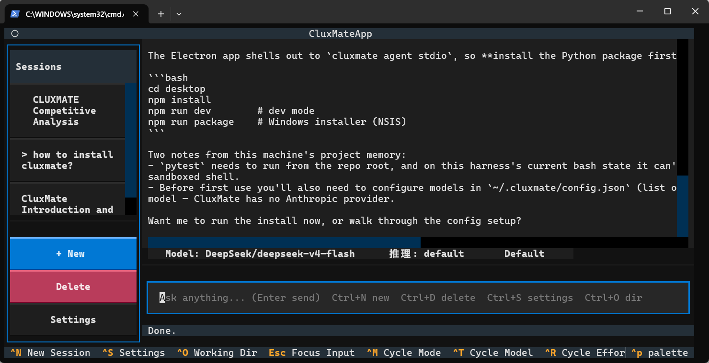
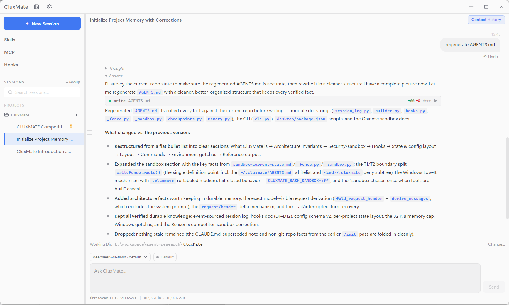
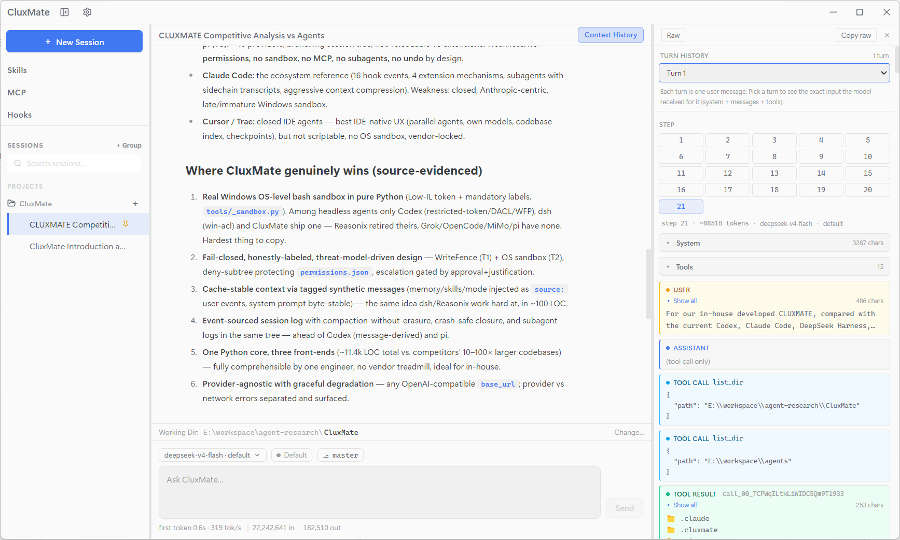
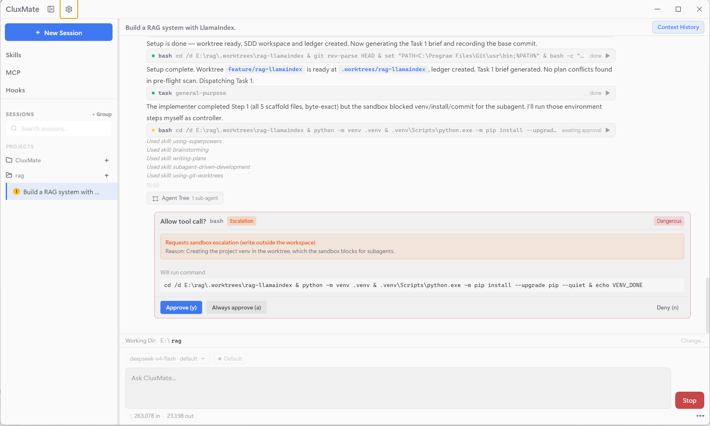
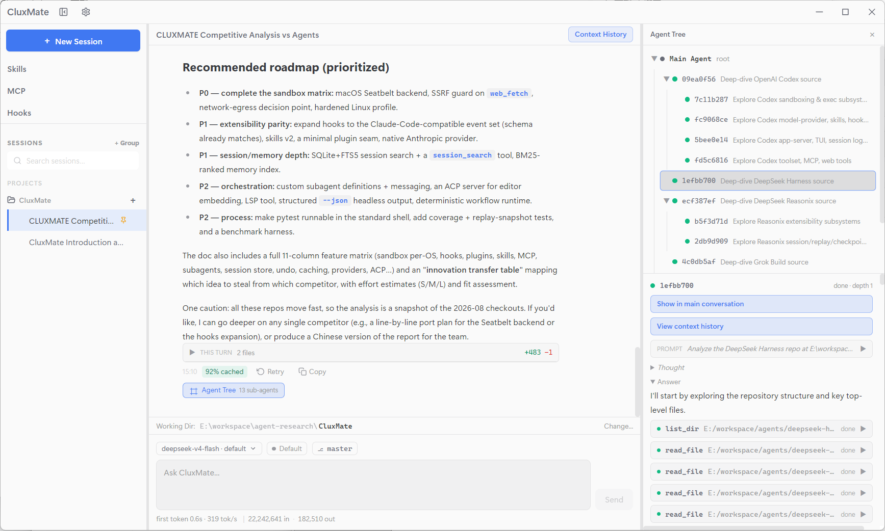
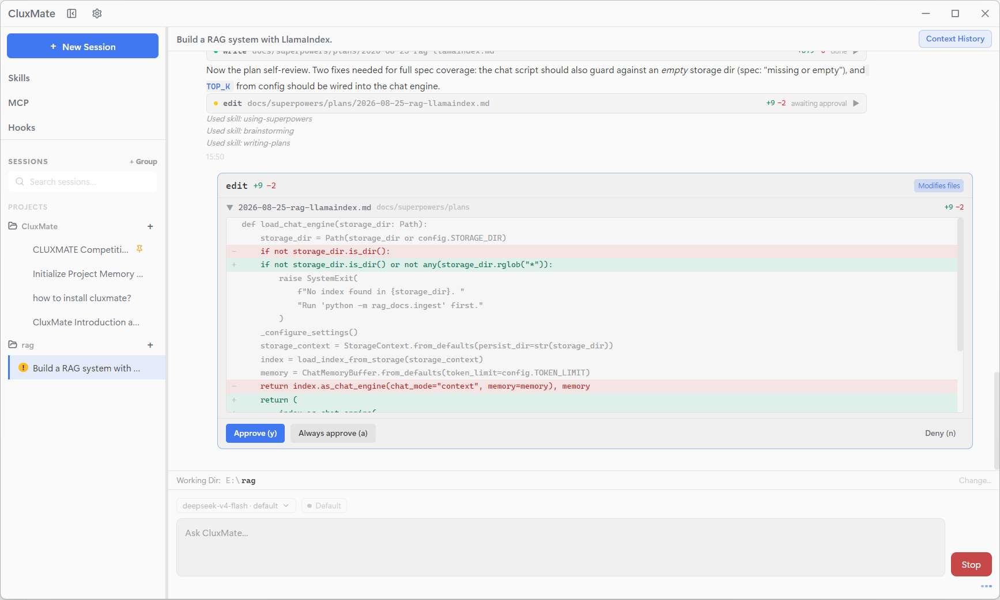

><div align="center">

# CluxMate

**An AI coding agent — one Python core, three front-ends.**


**English** · [中文文档](README.zh-CN.md)

</div>

---

## What is CluxMate?

CluxMate is an AI coding agent that reads your codebase, plans changes, edits files, runs commands, and answers questions. A single Python core powers **three interchangeable front-ends**:

| Front-end | What you get |
|---|---|
| **Headless CLI** | One-shot prompts for scripts, CI, and automation (`cluxmate -p "..."`) |
| **Textual TUI** | A full interactive terminal UI (`cluxmate`) |
| **Electron desktop** | A polished GUI that drives the same core over JSON-RPC (stdio) |

It speaks the **OpenAI-compatible API**, so it works with DeepSeek, Qwen, GLM, OpenAI, OpenRouter, Ollama, or any self-hosted endpoint using the same protocol — just point it at a `base_url`. No vendor lock-in.

## Screenshots

<p align="center">
  
  
</p>

## Highlights

- **One core, three front-ends** — the headless CLI, the REPL, the Textual TUI, and the Electron desktop all drive the exact same agent loop. The desktop app is a shell around that core; the Python agent remains fully usable on its own.
- **No vendor lock-in** — speaks any OpenAI-compatible API: DeepSeek, Qwen, GLM, OpenAI, OpenRouter, or a self-hosted endpoint. Configure multiple models and switch on the fly; provider failures never crash a turn, because timeouts, API errors, and network failures are translated into graceful, user-visible messages.
- **Event-sourced sessions, fully traceable** — every session is an append-only event log; the model's message history is *derived* from it, never stored separately. Every turn of every agent — main *and* subagents — is bracketed by `turn/start`/`turn/end`, every step logs `step/start`, `request/header`, and tool results, so the exact prompt sent at any step can be reconstructed and replayed verbatim, and context compaction rewrites a summary region without erasing the underlying events. See [Sessions you can replay](#sessions-you-can-replay) below.
- **Stable, cache-friendly context** — the system prompt never changes with your session: memory, skills, and mode are injected as tagged synthetic messages, so request prefixes stay stable and prompt caches stay hot — with per-turn cache-hit and latency metrics surfaced in the UI.
- **Risk-tiered permissions** — every tool declares a risk level (`safe` / `write` / `dangerous`); four modes (`plan` / `default` / `acceptEdits` / `yolo`) plus a persistent always-allow list control approval. `plan` mode is read-only by construction; dangerous commands always prompt.
- **A two-layer sandbox** — file write/delete tools are guarded by an in-process **WriteFence** (canonicalize-then-contain), and model-generated `bash` commands run inside an **OS-level sandbox** (Windows Low-integrity token). Sandboxing is *fail-closed* and only `yolo` mode — the explicit opt-out — disarms it. See [Security: sandbox](#security-sandbox).
- **Checkpoints & rewind** — a shadow-git repository per working directory snapshots your files before and after every turn, so you can undo any turn — session-scoped, so other sessions' edits surface as conflicts, never clobbered.
- **Subagent delegation** — delegate independent tasks to restricted subagents (`general-purpose`, read-only `explore`) with a depth cap of 4, each with its own replayable session log.
- **Doom-loop guard** — if the agent starts repeating identical tool calls, escalating advisories nudge it back on track; `MAX_TURNS` remains the hard backstop.
- **Skills, memory & MCP** — project-scoped skill packs, durable project memory (`AGENTS.md`), and Model Context Protocol servers (stdio / HTTP) plug into the same context pipeline.
- **Rich toolset, safely capped** — `bash`, file read/write/edit/delete, `grep`, `list_dir`, `web_fetch`, `web_search`, `ask_user_question`, subagents, skills, memory updates and more; every tool's output is capped and truncated to keep context bounded.

## Architecture at a glance

```text
┌──────────────────────────────────────────────┐
│                 Front-ends                   │
│  CLI ─── REPL ─── Textual TUI ─── Desktop    │
└──────────────────────────────────────────────┘
                     │
         JSON-RPC over stdio (desktop)
                     │
┌──────────────────────────────────────────────┐
│             Python agent core                │
│  AgentLoop ── SessionLog (event-sourced)     │
│  Builder ── Permissions ── Checkpoints       │
│  WriteFence ── Bash/MCP sandbox              │
│  Skills ── Memory ── MCP ── Subagents        │
└──────────────────────────────────────────────┘
                     │
         OpenAI-compatible API (httpx)
                     │
┌──────────────────────────────────────────────┐
│  DeepSeek · Qwen · GLM · OpenAI · any base   │
└──────────────────────────────────────────────┘
```

The **session log is the source of truth**: an append-only sequence of events from which the model's message history is derived. This keeps request prefixes stable (prompt-cache friendly), enables exact replay, and survives crashes.

## Sessions you can replay

Everything the agent does is recorded in an append-only event log — one `.jsonl` file per session — and the provider message history is *derived* from those events, never stored separately. That single source of truth buys a lot:

- **Every turn, every step** — each turn is bracketed by `turn/start` / `turn/end`; inside it, every model request logs `step/start` + `request/header` (config, system prompt, tool schemas — only when they *change*), and every tool call logs its result. The exact prompt sent at any step can be reconstructed verbatim (`session/context` shows it turn by turn).
- **Environment changes are logged too** — memory updates, skill loads, and mode switches are recorded as tagged synthetic `user/message` events (`source: memory` / `skill` / `mode`), and a mode or tool-schema change appends a fresh `request/header` with reason `change` — so replay shows *what the agent knew and could do* at every point, not just what it said.
- **Subagents included** — a subagent is just another agent loop with its own child `SessionLog`, linked to its parent via `subagent/spawn` pointers. Replaying a session replays the whole delegation tree, parents and children, in order.
- **Compaction without erasure** — when a context grows too long, compaction rewrites one region of the log into a single summary message (one `ReplaceOp`). The underlying events stay in the append-only log and the prompt-cache-friendly prefix stays intact — nothing is silently lost.
- **Crash-safe by construction** — a torn tail is dropped on load, and an interrupted turn is durably closed with synthetic `tool/result` + `turn/end {interrupted}` events, so a reloaded history is always a valid transcript. Undo rewinds to a turn boundary via a single `truncate`.

<p align="center">
  
</p>

## Security: sandbox

Permissions decide what is *allowed*; two enforcement boundaries make denials *stick*:

**① WriteFence (in-process)** — guards the five file tools (`write_file`, `search_replace`, `multi_edit`, `multi_write`, `delete_file`). Every path is canonicalized (`..` and symlinks resolved) then checked: deny-list first, containment second, *before any I/O*. Only the working directory, the platform temp dir, and your `~/.cluxmate/AGENTS.md` are writable — and `<project>/.cluxmate/` (permission config, MCP servers, skills) is always off-limits so a prompt-injected model can never edit its own permission settings.

**② Bash + MCP sandbox (OS-level)** — model-generated `bash` commands run under an OS sandbox instead of your full user:
- **Windows**: a Low-integrity token (`NO_WRITE_UP`) with the workspace tree labeled low — the shell can read and reach the network, but cannot modify anything above its integrity level.
- **Fail-closed**: if sandboxing is on but no backend is available, `bash` refuses to run rather than falling back to a bare subprocess. Escape hatch: `CLUXMATE_BASH_SANDBOX=off`.

Both boundaries are enabled in every mode **except `yolo`** — the one explicit opt-out that disarms everything. Writable-folder grants (`~/.cluxmate/sandbox-grants.json`) let you whitelist extra directories. The permission modes:

| Mode | Behavior | Sandbox |
|---|---|---|
| `plan` | Read-only toolset (writes aren't even registered) | Hard isolation |
| `default` | `safe` auto-approves; `write` / `dangerous` prompt | On |
| `acceptEdits` | `write` auto-approves; `dangerous` still prompts | On |
| `yolo` | Everything auto-approves, including `dangerous` | **Off** (opt-out) |

<p align="center">
  
</p>

## Subagents

Delegate independent work to child agents with restricted toolsets:

- **`general-purpose`** — the full read/write/bash toolset for any sub-task.
- **`explore`** — read-only (`read_file`, `grep`, `list_dir`, `web_fetch`, `web_search`) for research.

Subagents recurse up to a **depth cap of 4** (the `task` tool is withheld at the cap), and each one is a child `SessionLog` linked to its parent via `subagent/spawn` — replay walks the whole delegation tree.

<p align="center">
  
</p>

## Skills, memory & MCP

- **Skills** — project-scoped instruction packs (`<project>/.cluxmate/skills.json`) that the model can load on demand via the `use_skill` tool.
- **Memory** — a durable project memory file, `AGENTS.md`, rendered as a tagged synthetic message every turn. A legacy `CLAUDE.md` file is also honored as a read-only fallback.
- **MCP** — Model Context Protocol servers (stdio or HTTP) plug their tools straight into the agent's context; servers are loaded once per working directory and sandboxed on Windows like `bash`.


## Installation

### Requirements

- **Python ≥ 3.12**
- Node.js 18+ and npm (for the desktop app)

### 1. Python package

```bash
git clone https://github.com/<your-account>/cluxmate.git   # replace with the real URL
cd cluxmate

pip install .            # direct install
# or, for development — editable install (your changes take effect immediately):
pip install -e .
pip install pytest pytest-asyncio   # dev deps are not in pyproject.toml
```

After installation the `cluxmate` command is available on your `PATH`.

### 2. Desktop app

The desktop app drives the Python agent via `cluxmate agent stdio`, so **install the Python package first** and make sure `cluxmate` is on your `PATH`.

```bash
cd desktop
npm install
```

Then run it in one of two ways:

- **Development mode** — launches the app with hot reload, for working on the desktop code:

  ```bash
  npm run dev
  ```

- **Build & package** — compiles and produces a Windows installer (`dist/`):

  ```bash
  npm run package
  ```

Other useful commands:

```bash
npm run build      # compile only (electron-vite build)
npm run preview    # preview the built app
npm run typecheck  # type-check main + renderer
```

## Usage

```bash
cluxmate -p "Explain the session log design"                    # headless one-shot
cluxmate -p "Refactor this" --model-id deepseek                 # with a specific model entry
cluxmate -p "..." --reasoning-effort high                       # reasoning level (per-dialect)
cluxmate repl                                                   # interactive REPL
cluxmate                                                        # Textual TUI
cluxmate agent stdio                                            # JSON-RPC stdio server (desktop backend)
```

Run `cluxmate` once to seed a default config, then pick a model in the TUI/desktop Settings.

## Configuration

Global config lives at `~/.cluxmate/config.json` (schema v2) — a list of model *entries* plus the active model:

```json
{
  "version": 2,
  "models": [
    {
      "id": "deepseek",
      "api_type": "openai",
      "provider": "DeepSeek",
      "base_url": "https://api.deepseek.com",
      "api_key": "",
      "model_name": "deepseek-v4-flash",
      "context_1m": false,
      "max_tokens": 80000,
      "reasoning_efforts": ["low", "high", "max"]
    }
  ],
  "active_model_id": "deepseek"
}
```

- **`base_url`** — any OpenAI-compatible endpoint (DeepSeek, Qwen, GLM, OpenAI, OpenRouter, Ollama, self-hosted…).
- **`api_key`** — may be left empty; it falls back to the `DEEPSEEK_API_KEY` / `OPENAI_API_KEY` environment variables.
- **`context_1m`** — enable for providers with 1M-token contexts.
- **`max_tokens`** — output budget; leave empty/`0` for the 32768 default.
- **`reasoning_efforts`** — optional per-model override of the reasoning-effort levels (the system ships presets per dialect: DeepSeek / Qwen / GLM / OpenAI).

Per-project state (always-allow permissions, MCP servers, skills, sandbox grants, and hooks — user-defined shell commands at lifecycle points, configured in `settings.json`) lives under `<project>/.cluxmate/` — it stays with the project, not your home directory.

## Desktop app

The Electron desktop is a full-featured front-end for the same Python core:

- **Sessions & working directories** — switch projects, resume or delete sessions, search past sessions.
- **Git integration** — current branch awareness, per-turn **checkpoint timeline**, diff viewer, and undo/checkout across branches.
- **Inspectors** — agent inspector, context viewer (what the model saw), subagent tree, tool-call cards, permission cards.
- **Views** — hooks, MCP servers, skills, settings with per-model configuration (including reasoning effort).
- **Tray app** — stays in the system tray with a show/quit menu.

<p align="center">
  
</p>


## License

[MIT](LICENSE) — see the [LICENSE](LICENSE) file for details.
